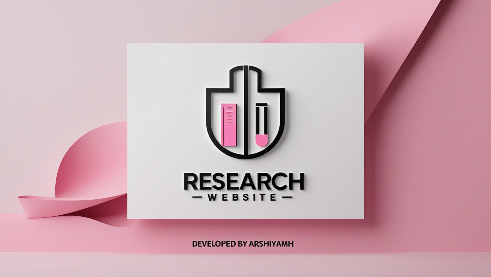

# Researcher Sign-Up Website

A responsive sign-up website for researchers, built with HTML and CSS. This project allows users to sign up in multiple ways, creating a clean and user-friendly experience across various devices. The design focuses on simplicity and accessibility, ideal for any research-related platform.
📌 **Features**
- ✅ Multiple sign-up methods for diverse user preferences
- ✅ Simple, clean, and user-friendly interface
- ✅ Built with HTML and CSS
- ✅ Optimized for seamless user experience

🛠️ **Technologies Used**
- HTML
- CSS

📥 **Installation & Usage**
No installation required. Simply open the HTML file in your browser 

📌 **DESIGN**

📜 **License**
This project is open-source and free to use.

🚀 **Developed by Arshiya MH**
